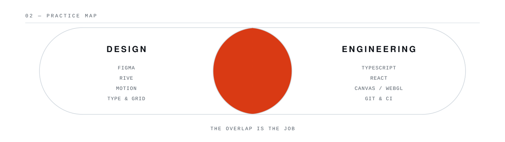

<!--
  Artwork is generated: edit build-assets.py and run `python3 build-assets.py`
  to re-render everything in assets/ for both colour schemes.
-->

<picture>
  <source media="(prefers-color-scheme: dark)" srcset="assets/header-dark.svg">
  
</picture>

I design interfaces and then build them, so most of my work happens in the gap
between those two verbs — the part where a mockup meets a browser and one of
them has to give.

At the moment that gap looks like: motion that still feels right inside a real
frame budget, design systems that survive the trip into code, and prototypes
solid enough to be argued with rather than admired.

## Selected work

|  |  |
| --- | --- |
| **[Medura](https://github.com/paryabhrmi/Medura)** &nbsp;·&nbsp; [live ↗](https://paryabhrmi.github.io/Medura/) | An interactive Rive prototype published as a static site. Pinned runtime and WebAssembly served from the repo, canvas rendered at true device pixel ratio, artboard-sampled letterboxing, playback paused off-screen. No third-party requests, so nothing outside the repository can break it. |
| **[git-for-designers](https://github.com/paryabhrmi/git-for-designers)** | Version control explained for people who live in a design tool — the mental model first, the commands second. |
| **[paryabahrami.ir ↗](https://paryabahrami.ir)** | Portfolio, case studies, and the longer version of all of this. |

<picture>
  <source media="(prefers-color-scheme: dark)" srcset="assets/practice-dark.svg">
  
</picture>

## How I work

**Prototype before opinion.** A build in the browser settles arguments that a
static frame can only start. If it is worth debating, it is worth making real
first.

**Specify in numbers.** "Snappier" is not a handoff. Durations, easing curves,
token names and breakpoints are — they are the difference between a design that
survives implementation and one that gets approximated.

**Own the last ten percent.** Focus states, reduced-motion, keyboard paths, the
loading moment, the empty state. It is the part everyone agrees matters and
nobody schedules.

## Toolkit

| | |
| --- | --- |
| **Design** | `Figma` `Rive` `After Effects` `type & grid systems` |
| **Build** | `TypeScript` `React` `Canvas / WebGL` `SVG` `CSS` |
| **Between** | `design tokens` `motion spec` `component APIs` `Git` `CI` |

## Elsewhere

[paryabahrami.ir](https://paryabahrami.ir) &nbsp;·&nbsp; [@paryabhrmi](https://github.com/paryabhrmi)

Every image on this page is an SVG generated by
<a href="build-assets.py"><code>build-assets.py</code></a> and served from this
repository — no badge services, no stat APIs, nothing that can rate-limit,
drift, or 404. Both colour schemes are hand-tuned; motion respects
<code>prefers-reduced-motion</code>.
